# 🍰 Baked Goodies — Online Cake Ordering Web App

A fully responsive e-commerce web application designed for a small cake business.  
Customers can browse cakes, place orders, track their purchase status, and rate their experience.  
Sellers/admins can manage incoming orders, verify payments, upload final cake images, and maintain customer records.

---

##  Table of Contents
- Overview  
- Features  
- Screenshots  
- Tech Stack  
- Project Structure  
- Installation  
- Environment Variables  
- Usage  
- Ordering Flow  
- Admin/Seller Features  

---

##  Overview
**Baked Goodies** provides an easy-to-use online ordering system for customizable cakes.  
The platform supports both **customer-facing features** and a **dedicated admin panel** that simplifies the order management workflow.

The system includes:
- A 3-step ordering process  
- Email notifications  
- Payment request with QR codes  
- Order ratings  
- Order history tracking  
- Admin control over requests, ongoing orders, and customer records

---

##  Features

### **Customer Features**
- Browse cakes and see detailed descriptions  
- 3-step order process (Review → Pickup Date → Payment Info)  
- View current orders and order history  
- Receive email notifications for:
  - Acceptance / Decline (with reason)  
  - Payment request  
  - Final cake image  
- Upload proof of payment  
- Rate completed orders  

### **Admin/Seller Features**
- Manage order **Requests**, **Ongoing Orders**, and **History**  
- Accept or decline orders (with required decline reason)  
- Mark orders as *Rush* or *Not Rush*  
- Upload final cake images for finished orders  
- Send payment request emails with:
  - GCash QR  
  - BDO account details  
- Verify proof of payment or mark the order as scam/bogus  
- Manage customer list and cake database  
- Update admin account details  

---

##  Screenshots  
_Add your images below. Replace the placeholders with actual file paths in your repo._

### **Customer Side**
#### Home Page  
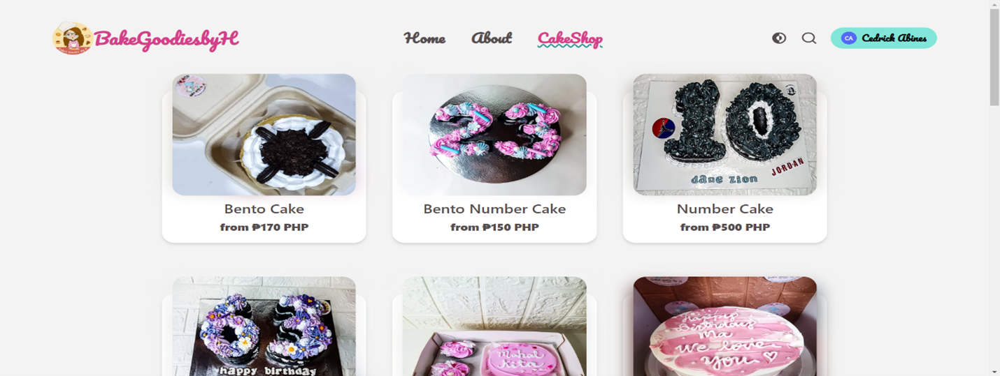

#### Cake Details
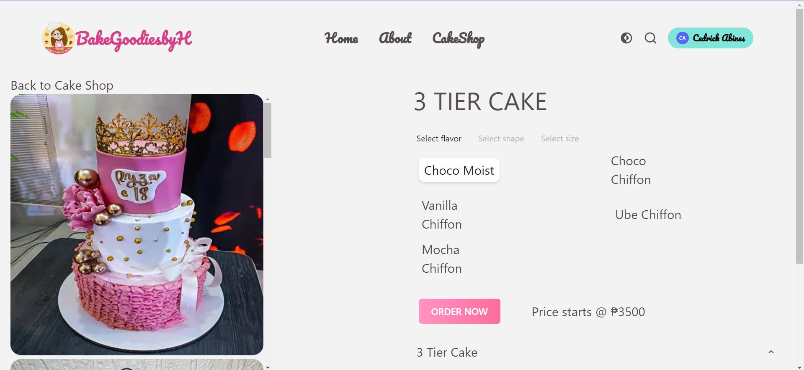

#### Ordering — Step 1 (Review Order)  
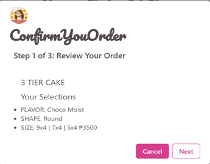

#### Ordering — Step 2 (Pickup Date)  
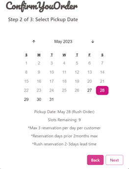

#### Ordering — Step 3 (Payment Info)  
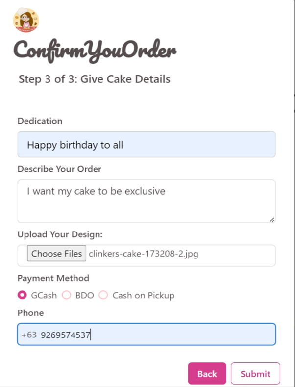

#### My Orders  
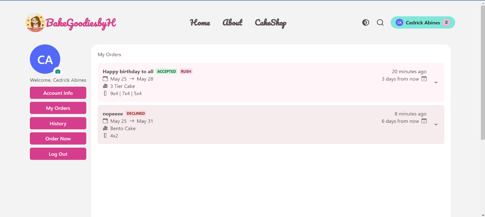

#### Ratings & Comments  
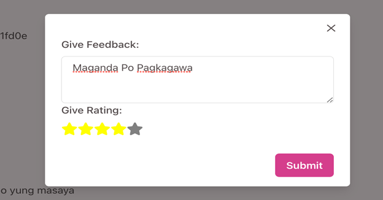

---

### **Admin/Seller Side**
#### Requests  
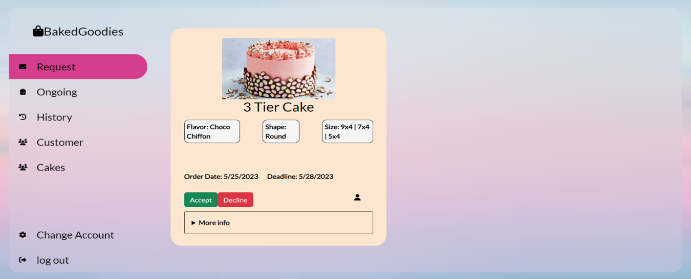

#### Accept / Decline  
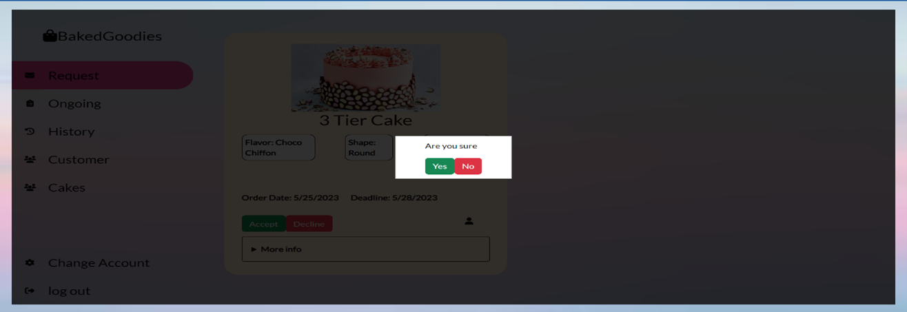

#### Ongoing Orders  
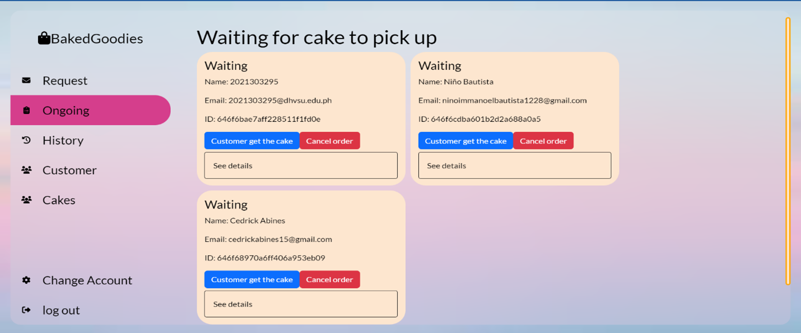

#### Payment Verification  
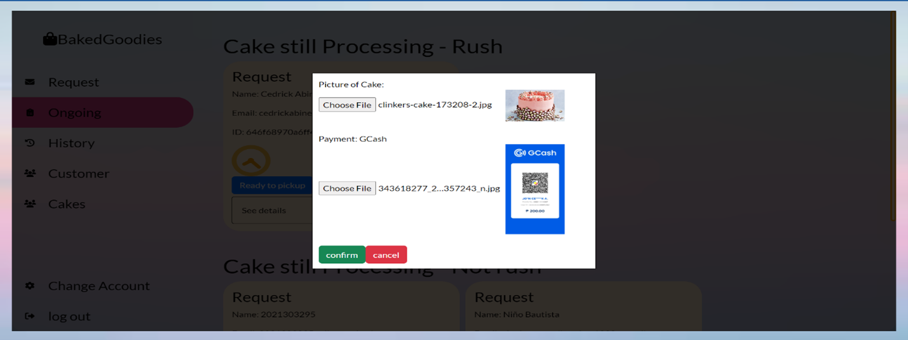

---

##  Tech Stack

### **Frontend**
- React
- Typescript  

### **Backend**
- Node.js + Express  

### **Database**
- MongoDB

### **Other Technologies**
- Email service (SMTP / SendGrid)  
- QR code payment links (GCash / BDO)  
- Responsive design

---

##  Project Structure
```
/
├─ public/               # Static files
├─ src/                  # Main app source
│  ├─ pages/
│  ├─ components/
│  ├─ services/          # API, email, payment services
│  ├─ utils/
│  └─ styles/
├─ admin/                # Admin panel (if separated)
└─ README.md
```

##  Usage

### Customer Side
- Browse cakes  
- Place an order via 3-step checkout  
- Receive payment request via email  
- Upload proof of payment  
- Track order progress  
- View final cake image and rate the order  

### Seller/Admin Side
- Login to admin panel  
- View incoming requests  
- Accept / decline orders  
- Send payment request  
- Upload cake photo  
- Confirm payment or mark as scam  

---

##  Ordering Flow (Customer)

1. **Customer selects a cake**  
2. **Step 1:** Review order summary  
3. **Step 2:** Choose pickup date  
4. **Step 3:** Choose payment method (GCash/BDO)  
5. Seller **Accepts** → sends payment link  
6. Customer uploads payment proof  
7. Seller marks order as **Paid**  
8. Seller uploads **final cake image**  
9. Customer receives email + views finished order  
10. Customer leaves rating/comment  

---

##  Admin/Seller Workflow

1. View **Requests**  
2. Accept/Decline (Decline needs a reason)  
3. Move to **Ongoing Orders**  
4. Mark Rush/Not Rush  
5. Upload completed cake image  
6. Send payment request (QR)  
7. Verify payment  
8. Move to **History**  

---

